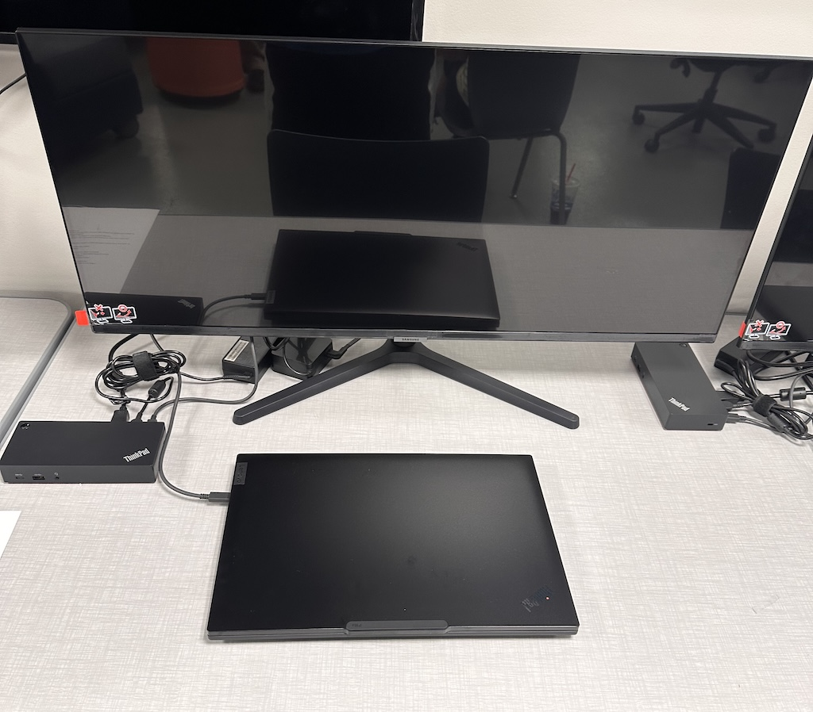
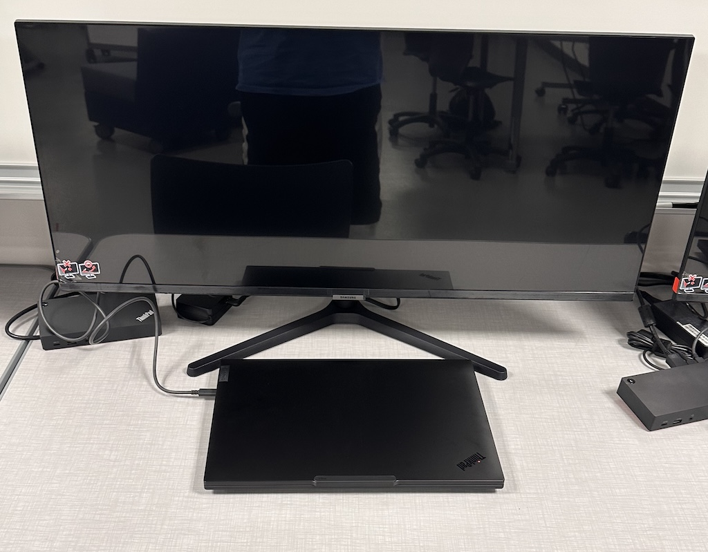

---

# CS Lab Workstation

Image |August 2026

## Summary

We set up the Lab with our workstations.

**Project:** CS Lab Launch

**My role:** I was able to collaborate with fellow students to create our workstations. I was also able to set up my own workstation and understand what each component does. I was also showing responsibility because we were handling expensive equipment so we had to be responsible in the way that we interacted with the equipment. I was also able to show reliability because I set up three different workstations and they all worked with no issues showing that I can be relied on to do things.

## The Artifact

[View the full artifact](LINK-TO-ARTIFACT)

## Skills Demonstrated

Collaboration
Responsibility
Reliability

## Implementation

I created this artifact by unboxing the parts and assemebling them together to create the workstations.

---

[Return to All Artifacts]({{ '/artifacts.html' | relative_url }})