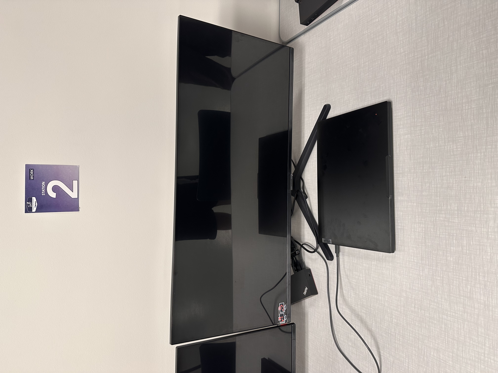

        ---
layout: default
title:  CS Lab Workstation
---

# CS Lab Workstation

Image |August 2026

## Summary

[Write a short paragraph explaining what this artifact is and the context in which it was created. Include the larger project or challenge when relevant.]

**Project:** CS Lab Launch

**My role:** [Briefly describe your individual contribution, especially if this was collaborative work.]

## The Artifact

[View the full artifact](LINK-TO-ARTIFACT)

## Skills Demonstrated

[Skill]
[Skill]
[Skill]

## Tools and Technologies

- [Tool, language, platform, or technology]
- [Tool, language, platform, or technology]
- [Tool, language, platform, or technology]

## Implementation

[Explain how you created this artifact. Describe the major decisions, technical work, problem-solving, testing, troubleshooting, or revisions involved.]

[Include process images if they help explain your work.]

## What I Learned

[Describe what you learned technically or professionally and what you would do differently next time.]

---

[Return to All Artifacts]({{ '/artifacts.html' | relative_url }})