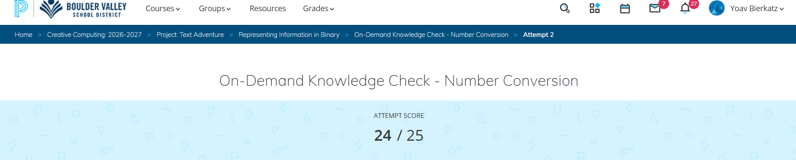

# Knowledge Check Number Conversions

Knowledge Check | August 2026

## Summary

This artifact is a test of my knowledge as a student and my ability to convert numbers. We specifically focused on converting numbers from base 10 to binary, and Hexadecimal and from binary to Hex ect.. The context in which it is created is the fact the in the future we will be creating a text adventure experience it should know how computers store and read information. The larger project behind this Knowledge Check is the text adventure experience that we will be making later in the year.

**Project:** Number Conversions Knowledge Check

**My role:** My role in this was to use my knowledge of number conversions and show that I truly know how to use them in a real scenario and not just in practice. 

## The Artifact

The image is the score that I got from taking the Number Conversions Knowledge Check 

[View the full artifact](LINK-TO-ARTIFACT)

## Skills Demonstrated

Understanding of binary,
Understanding of Hex,
Understanding of conversions.

## What I Learned

I learned that I knew slightly more Hex and binary than what I would have expected to remember from over the summer. Something I would do differently next time is to practice more on being able to look at binary and know what the value is from what place the 1's are in.

---

[Return to All Artifacts]({{ '/artifacts.html' | relative_url }})