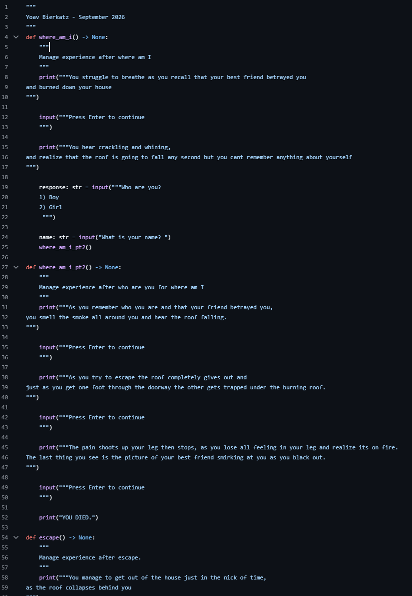

---
Text Adventure Plan
---

# Text Adventure Plan

 Text adventure | September 2026

## Summary

This artifact is a interactive text adventure. The context in which it was created was to test our knowledge of python and see if we could actually make and develop games and not just practices. 

**Project:** Red or Blue Pill

**My role:** My role in this project was to come up with an idea for a interactive text adventure game. I was then instructed to use my knowledge in python to attempt to implement the flow chart that was made into actual code. We did this by splitting each "branch" into different functions and connecting them with if statements.

## The Artifact

[View the full artifact](https://github.com/Yoav321/Red-or-Blue-pill)

## Skills Demonstrated

[Skill]
[Skill]
[Skill]

## Tools and Technologies

- Git, Python, VS Code.

## Implementation

In the creation of this artifact I used VS Code to write and test the code along with draw.io to help me create the flowchart. The major decision at first were to come up with an idea and once that was done all I had to do was finish the plan and start implementing. The technical work was figuring out how to use multiple different functions and making sure that they work together. 

## What I Learned

Something that I learned technically was how to use and combine multiple different functions so that the code is more organized and easier to find and read the bugs. Another thing that I learned how to do was use the Python debugger to find any potential bugs in my code.

---

[Return to All Artifacts]({{ '/artifacts.html' | relative_url }})